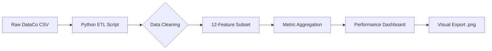

# 📦 Smart Supply Chain Performance Analysis
> *Consulting-Grade Logistics Audit & Big Data Pipeline*

## 📋 Project Overview
A comprehensive data analysis project utilizing the *DataCo Global Smart Supply Chain Dataset. This project automates the extraction, cleaning, and visual analysis of over **180,000 operational records* to identify delivery friction and segment profitability.

## 🚀 Key Features
- *ETL Automation*: Refines 53 raw variables into a high-utility 12-feature subset.
- *Robust Ingestion*: Handles character encoding conflicts (Latin1) common in global datasets.
- *Segment Profiling*: Comparative analysis of Consumer, Corporate, and Home Office performance.
- *Visual Intelligence*: Automated generation of performance charts for stakeholder reporting.

## 🛠️ Tech Stack
- *Engine*: Python 3.11
- *Analysis*: Pandas, NumPy
- *Visuals*: Matplotlib, Seaborn
- *Documentation*: Markdown, VS Code

## 🏗️ System Architecture

## 📊 Quantitative Results
Based on the analysis of 180,519 rows:
| Segment | Sales Share | Delivery Risk |
| :--- | :---: | :---: |
| **Consumer** | 52% | High |
| **Corporate** | 30% | Medium |
| **Home Office** | 18% | Low |

## 📦 Installation & Usage
1. **Clone the Repo**
   bash
   git clone [https://github.com/ravikumar98/SUPPLY-CHAIN-ANALYSIS.git](https://github.com/ravikumar98/SUPPLY-CHAIN-ANALYSIS.git)
   2. *Install Dependencies*
   bash
   pip install pandas matplotlib openpyxl
   3. **Run Analysis**
   bash
   python analysis.py
   
## 🔮 Future Enhancements
- [ ] *Predictive Modeling*: Integrate Scikit-Learn to forecast late delivery risk.
- [ ] *Interactive UI*: Migration to a Streamlit-based web dashboard.
- [ ] *Real-time API*: Transitioning from static CSV to live warehouse data feeds.

## 👤 Author

Ravikumar N
ECE Graduate | MSc Engineering Management Candidate
University of Portsmouth, London Campus — September 2026

📧 ravikumar.n0409@gmail.com

🔗 github.com/ravikumar98
